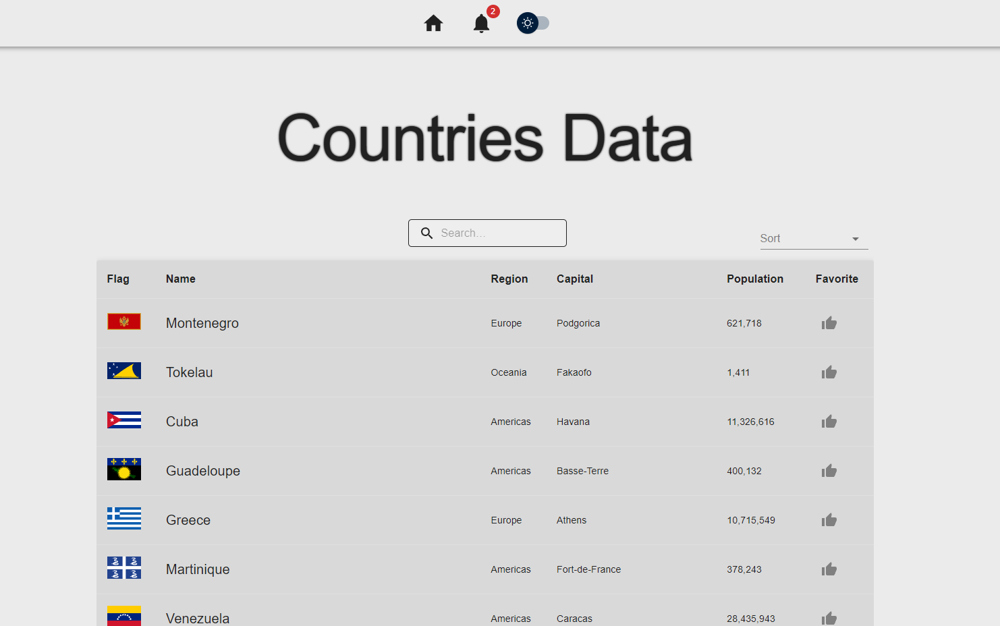
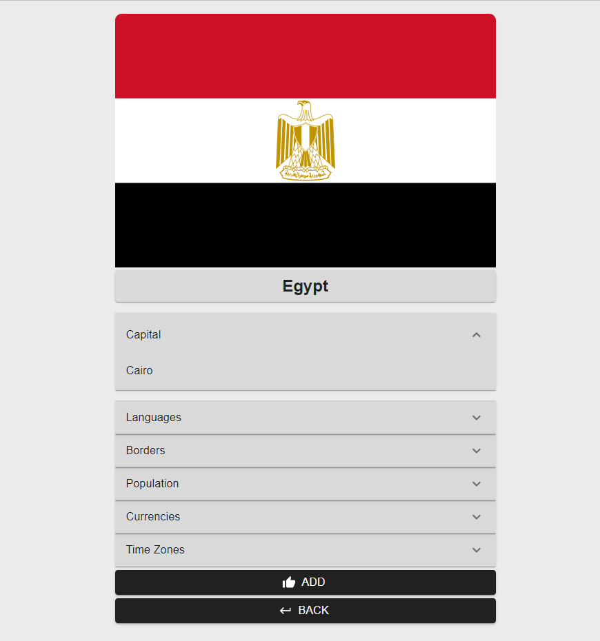
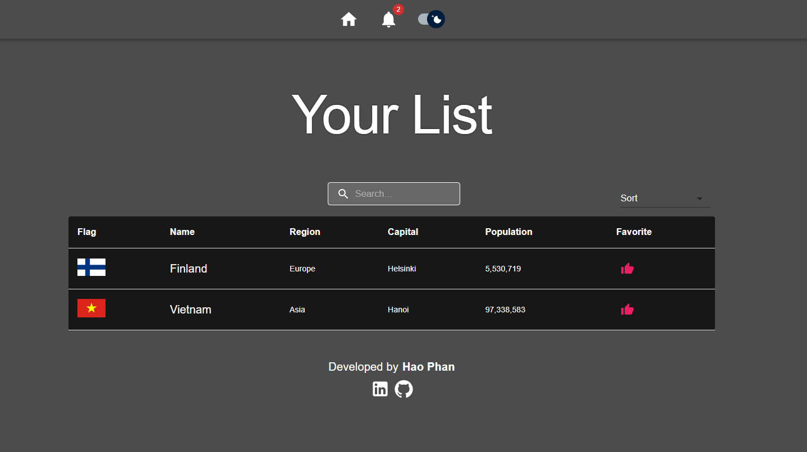

# Countries Data

    https://haophan-countries-data.netlify.app/

# Features

    Displaying a list of countries

    Retrieving detailed information of each country

    Searching

    Sorting

    Adding favorite

    Switching theme

# REST Countries API

    https://restcountries.com/

# Technology stacks

    React

    React-router

    Typescript

    Redux

    Redux-thunk

    Material UI

    Prettier

# Preview

